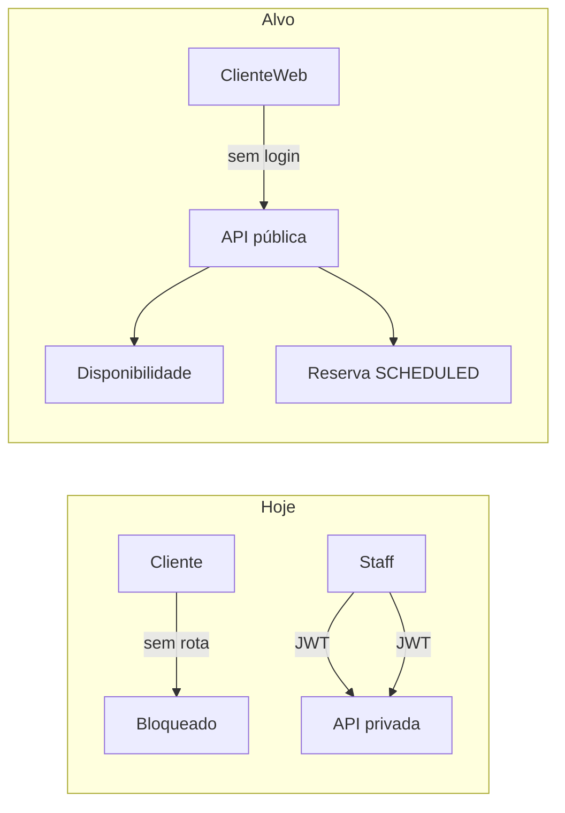
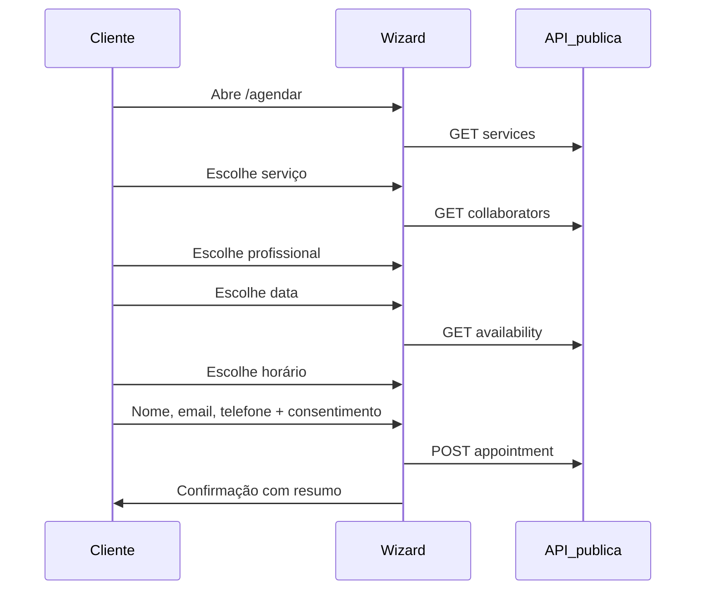

# Landing page de agendamento para clientes

## Contexto atual

- O app interno ([`fashion-hair-frontend`](fashion-hair-frontend)) exige login; rotas em [`router.tsx`](fashion-hair-frontend/src/routes/router.tsx).
- **Todas** as APIs de serviços, colaboradores e agendamentos exigem JWT ([`requireAuth`](fashion-hair-backend/src/shared/middlewares/requireAuth.ts)).
- Criação de agendamento já valida expediente, sobreposição e grava cliente com `name`, `phone`, `email?` ([`appointments.schema.ts`](fashion-hair-backend/src/modules/appointments/appointments.schema.ts)).
- **Não existe** endpoint de “horários disponíveis”; só há utilitários (`timeToMinutes`, `hasTimeOverlap`, `generateTimeSlots` no frontend em [`date.ts`](fashion-hair-frontend/src/lib/date.ts)).



## Decisões confirmadas

| Item | Escolha |
|------|---------|
| Contato | Nome, **e-mail** e **telefone** (obrigatórios) |
| Profissional | Cliente **escolhe o profissional**, depois vê horários dele |
| Preço na reserva pública | Preço do catálogo do serviço (`standardPriceOnly`, sem price book na criação pública — alinhado à regra recente do staff) |

## Arquitetura proposta

### Backend — módulo `public-booking`

Novo prefixo: `/api/v1/public` (sem `requireAuth`, rate limit mais restritivo no POST).

| Método | Rota | Função |
|--------|------|--------|
| `GET` | `/services` | Lista serviços `isActive` (id, nome, duração, preço, descrição curta) |
| `GET` | `/collaborators` | Lista colaboradores ativos com perfil (id, nome, specialty, avatar) |
| `GET` | `/availability` | Query: `collaboratorId`, `serviceId`, `date` (YYYY-MM-DD) → slots livres |
| `POST` | `/appointments` | Corpo da reserva + consentimento LGPD |
| `GET` | `/privacy-policy` | Texto/versão da política (para exibir e versionar consentimento) |

**Algoritmo de disponibilidade** (novo serviço, ex.: `public-booking.service.ts`):

1. Carregar serviço (`durationMin`) e `workingHours` do colaborador para o `dayOfWeek` da data ([`validateWorkingHours`](fashion-hair-backend/src/modules/appointments/appointments.service.ts) já resolve o dia).
2. Gerar candidatos de `startTime` em passos de `durationMin` (ou mínimo 15 min) entre `startTime`/`endTime` do expediente.
3. Remover slots que:
   - ultrapassam o fim do expediente (`start + duration <= end`);
   - colidem com agendamentos existentes (`status` não em `CANCELLED`, `NO_SHOW`) via `hasTimeOverlap`;
   - já passaram (se data = hoje, comparar com horário local do salão — configurável `TZ=America/Sao_Paulo` em [`env`](fashion-hair-backend/src/config/env.ts)).
4. Limitar janela de agendamento (ex.: hoje até +30 dias) para evitar abuso.

**Criação pública** — extrair núcleo de [`createAppointmentService`](fashion-hair-backend/src/modules/appointments/appointments.service.ts) ou chamá-lo com:

- `newClient`: `{ name, phone, email }` (e-mail obrigatório no schema público);
- `price`: omitido + `standardPriceOnly: true`;
- `requestUserId`: `collaboratorId` (auditoria) ou usuário sistema via `PUBLIC_BOOKING_ACTOR_ID` no `.env`;
- `status`: `SCHEDULED`;
- flag `source: PUBLIC_WEB` no cliente/consentimento.

**Segurança**

- Rate limit dedicado no POST (ex.: 10 req/min por IP) além do global já em [`server.ts`](fashion-hair-backend/src/server.ts).
- Respostas sem dados sensíveis (não expor telefone de outros clientes).
- Validação Zod espelhando regras internas.
- Campo honeypot opcional no body (ignorado se preenchido → 400 silencioso).
- CORS: incluir domínio da landing em `CORS_ORIGIN`.

Registrar rotas em [`server.ts`](fashion-hair-backend/src/server.ts) **antes** das rotas autenticadas conflitantes.

---

### LGPD

**Base legal:** execução de contrato/pedido do titular (agendamento) + legítimo interesse limitado (lembrete operacional).

**Na UI (etapa final do wizard):**

- Checkbox **obrigatório**: “Li e aceito a Política de Privacidade” (link abre modal/página).
- Texto claro: finalidade (agendar atendimento, contato sobre o horário), dados coletados (nome, e-mail, telefone), retenção, direitos (acesso, correção, exclusão — canal `privacidade@...` ou formulário).
- Checkbox **opcional** separado: comunicações de marketing (desmarcado por padrão).

**No banco** — migration em [`schema.prisma`](fashion-hair-backend/prisma/schema.prisma):

```prisma
// Campos sugeridos em Client (ou tabela ClientConsent 1:N)
privacyPolicyVersion  String?
privacyConsentedAt    DateTime?
marketingOptIn        Boolean @default(false)
bookingSource         String? // "PUBLIC_WEB"
```

Gravar `privacyPolicyVersion` + `privacyConsentedAt` no momento do `POST` público.

**Páginas estáticas no frontend:**

- [`/agendar/privacidade`](fashion-hair-frontend) — política completa (markdown ou componente).
- Rodapé com link + CNPJ/razão social do salão (placeholder configurável via env `VITE_SALON_*`).

**Boas práticas adicionais:** não usar cookies de tracking na v1; se usar analytics depois, banner de cookies separado.

---

### Frontend — landing + wizard

**Rota pública** no mesmo projeto Vite (reaproveita Tailwind/shadcn, [`vercel.json`](fashion-hair-frontend/vercel.json) já cobre SPA):

| Rota | Página |
|------|--------|
| `/agendar` | Landing + wizard |
| `/agendar/privacidade` | Política de privacidade |
| `/agendar/confirmacao/:id` | Tela de sucesso (opcional; pode ser state local sem ID exposto) |

**Layout:** `PublicBookingLayout` — header minimal (logo Fashion Hair), sem sidebar, fundo claro, tipografia consistente com o app.

**Estrutura de pastas sugerida:**

```
fashion-hair-frontend/src/features/public-booking/
  PublicBookingPage.tsx      # shell + stepper
  steps/
    ServiceStep.tsx
    ProfessionalStep.tsx
    DateTimeStep.tsx         # calendário + grade de horários
    ContactStep.tsx          # nome, email, phone + LGPD
    ConfirmationStep.tsx
  components/
    BookingStepper.tsx
    SlotGrid.tsx
    ServiceCard.tsx
  api/publicBooking.ts       # axios sem token
  hooks/usePublicBooking.ts
```

**API client:** instância axios separada (`publicApi`) sem interceptor de JWT — base `VITE_API_URL`.

**Fluxo UX (mobile-first, 4–5 passos):**



**UI/UX (moderno e rápido):**

- Hero: headline (“Agende seu horário em minutos”), CTA “Começar”.
- Stepper horizontal com progresso e botão “Voltar”.
- Cards de serviço com preço, duração e seleção visual (borda/ring primária).
- Lista/grid de profissionais com avatar/iniciais e especialidade ([`SPECIALTY_LABELS`](fashion-hair-frontend/src/lib/enumLabels.ts)).
- Seletor de data nativo + chips de horários disponíveis (estado loading/skeleton, empty state “Sem horários neste dia”).
- Formulário com máscara de telefone ([`PhoneInput`](fashion-hair-frontend/src/components/shared/PhoneInput.tsx)), validação inline, resumo antes de confirmar.
- Estados: loading, erro com retry, sucesso com ícone e dados do agendamento.
- Acessibilidade: labels, `aria-current` no stepper, contraste, foco visível, mensagens de erro associadas aos campos.
- Performance: lazy route `/agendar` no router; React Query com `staleTime` nos catálogos.

**Router** — adicionar rotas **fora** de `ProtectedRoute` em [`router.tsx`](fashion-hair-frontend/src/routes/router.tsx); link opcional “Agendar online” na [`LoginPage`](fashion-hair-frontend/src/features/auth/LoginPage.tsx).

---

## Fases de entrega

### Fase 1 — MVP (escopo principal)

- APIs públicas (catálogo, disponibilidade, reserva + LGPD no banco).
- Wizard completo em `/agendar`.
- Política de privacidade v1.
- Deploy na mesma Vercel; variáveis de ambiente documentadas.

### Fase 2 — Refinamentos (pós-MVP)

- E-mail de confirmação (Resend/SendGrid) ao cliente e notificação interna.
- Admin: toggle “agendamento online ativo” em configurações do salão.
- reCAPTCHA/Turnstile se houver abuso.
- Cancelamento/reagendamento pelo cliente via link mágico (token único) — escopo maior.

---

## Arquivos principais a criar/alterar

| Camada | Arquivos |
|--------|----------|
| Backend | `src/modules/public-booking/*` (schema, service, controller, routes) |
| Backend | `prisma/schema.prisma` + migration consentimento |
| Backend | `src/server.ts`, `src/config/env.ts` (TZ, janela de dias, actor id) |
| Frontend | `src/features/public-booking/**`, `src/routes/router.tsx` |
| Frontend | `src/api/publicBooking.ts`, env `VITE_SALON_NAME`, etc. |
| Docs | Seção curta no README do frontend sobre `/agendar` e variáveis |

---

## Testes recomendados

- **Backend:** unitários do gerador de slots (expediente, overlap, dia passado); integração do POST público com consentimento gravado.
- **Frontend:** teste do schema de contato (e-mail/telefone); smoke do stepper (vitest + Testing Library).
- **Manual:** fluxo completo mobile; recarregar `/agendar/horario` (SPA); tentativa de double-book no mesmo slot.

---

## Riscos e mitigação

| Risco | Mitigação |
|-------|-----------|
| Double booking concorrente | Transação Prisma + unique constraint lógica (re-check overlap no create) |
| Spam de reservas | Rate limit + honeypot |
| LGPD incompleta | Versão de política versionada; não coletar dados além do necessário |
| Fuso horário | `America/Sao_Paulo` explícito no cálculo de “hoje” |
